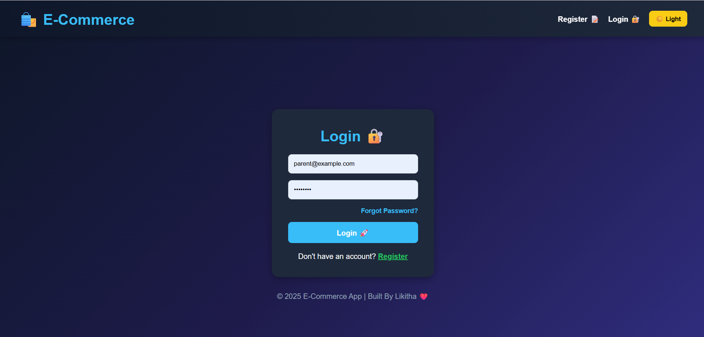
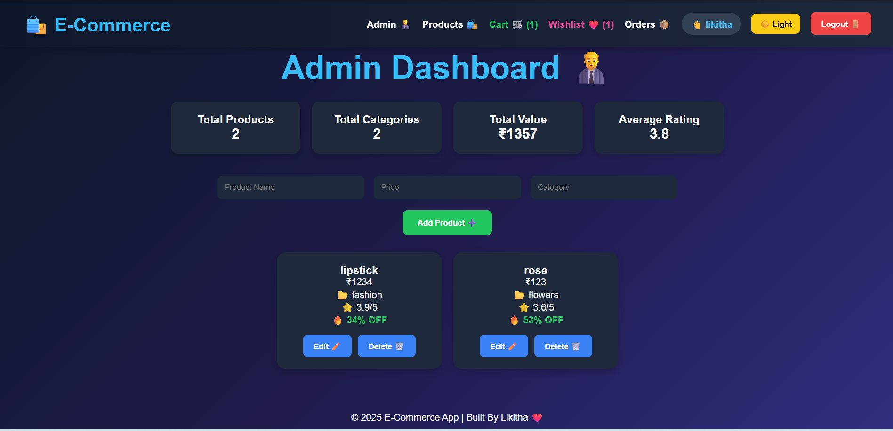
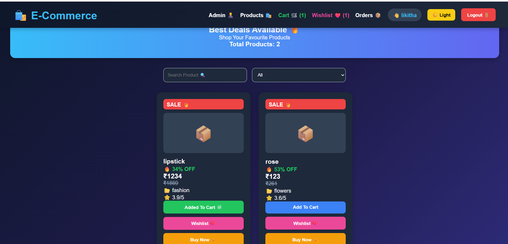
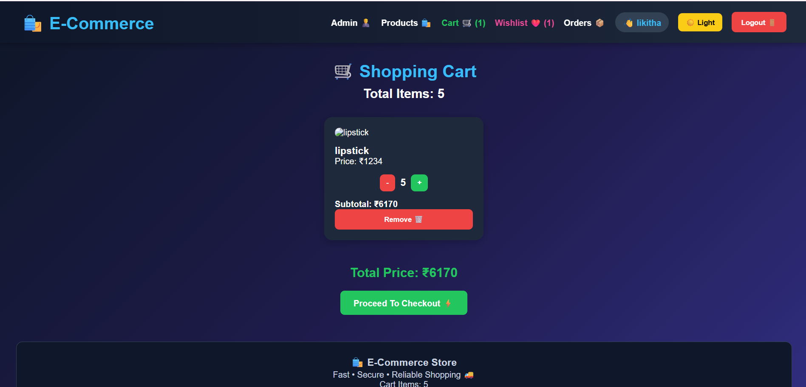
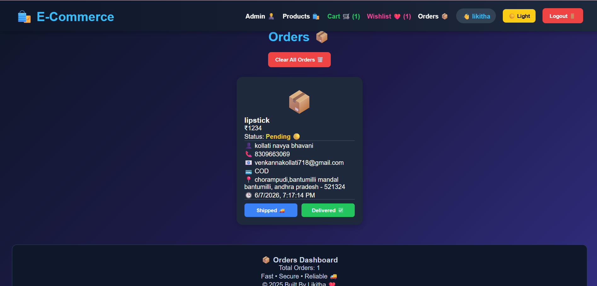

# 🛒 React E-Commerce Application
🌐 Live Demo

🔗 https://react-ecommerce-app-iota-pearl.vercel.app/

📂 GitHub Repository
🔗 https://likitha-yarraguntla.github.io/react-ecommerce-app/

A modern and responsive E-Commerce web application built using React.js. This project provides a complete shopping experience with authentication, product management, cart, wishlist, checkout, and order tracking functionality.

## 🚀 Features

### 👤 Authentication

* User Registration
* Login System
* Forgot Password
* Session Management

### 👨‍💼 Admin Dashboard

* Add Products
* Edit Products
* Delete Products
* Product Statistics

### 🛍️ Shopping Features

* Product Listing
* Search & Filter
* Add to Cart
* Wishlist Management
* Buy Now Functionality

### 📦 Order Management

* Checkout Process
* Place Orders
* Order Tracking
* Update Order Status

### 🎨 User Interface

* Dark Theme / Light Theme
* Responsive Design
* Modern Dashboard
* Interactive Navigation

## 🛠️ Tech Stack

* React.js
* React Router DOM
* JavaScript (ES6+)
* HTML5
* CSS3
* LocalStorage

## 📸 Project Screenshots

### Login Page

### Admin Dashboard

### Products Page

### Cart Page

### Wishlist Page

### Orders Page

## 🎯 Learning Outcomes

* React Hooks (useState, useEffect)
* Component-Based Architecture
* Routing with React Router
* CRUD Operations
* State Management
* LocalStorage Data Persistence
* Responsive UI Design

## 🔮 Future Enhancements

* Node.js Backend
* Express.js API
* MongoDB Database
* JWT Authentication
* Razorpay Integration
* Product Reviews & Ratings

## 👩‍💻 Developer

**Likitha**

Frontend Developer passionate about building responsive and user-friendly web applications with React.js.

⭐ If you like this project, consider giving it a star on GitHub.
